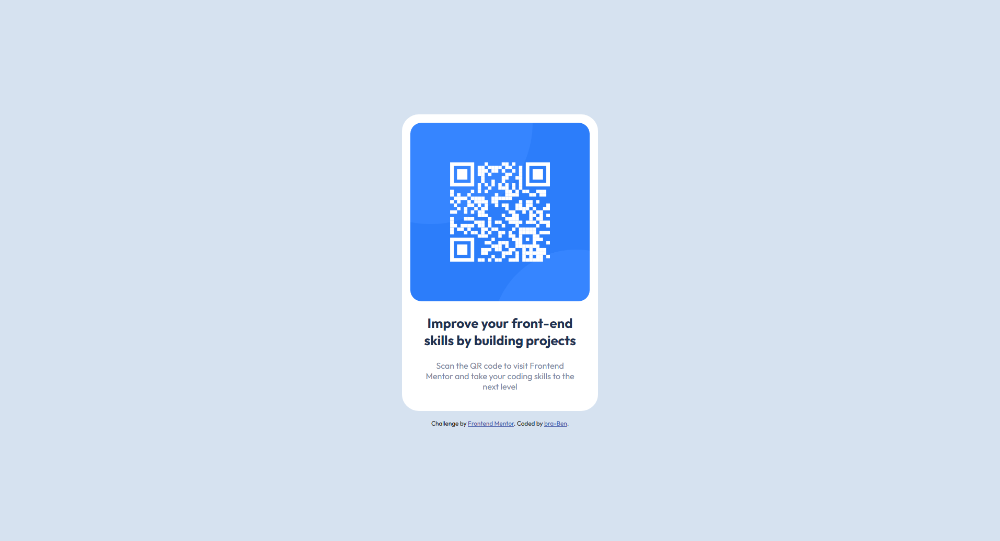

# Frontend Mentor - QR code component solution

This is a solution to the [QR code component challenge on Frontend Mentor](https://www.frontendmentor.io/challenges/qr-code-component-iux_sIO_H). Frontend Mentor challenges help you improve your coding skills by building realistic projects. 

## Table of contents

- [Overview](#overview)
  - [Screenshot](#screenshot)
  - [Links](#links)
- [My process](#my-process)
  - [Built with](#built-with)
  - [What I learned](#what-i-learned)
  - [Continued development](#continued-development)
  - [Useful resources](#useful-resources)
- [Author](#author)
- [Acknowledgments](#acknowledgments)

## Overview

### Screenshot

### Links

- Solution URL: [Add solution URL here](https://your-solution-url.com)
- Live Site URL: [QR Code Component](https://bra-ben.github.io/QR-Code-Component/)

## My process

### Built with

- Semantic HTML5 markup
- Flexbox
- Mobile-first workflow

### What I learned

I got good understand of flexbox and how to set the apporpiate `width` property for an image within a container. 

### Continued development
I want to continue to learn how build a responsive site by using MObile-first workflow.

### Useful resources

- [Colt Steele](https://www.youtube.com/@ColtSteeleCode) -  Colt Steel is a great guy and his tutorials on Flexbox really helped me on this project.
- [Mozilla Developer Network](https://developer.mozilla.org/en-US/) - MDN always come to the rescue when i am lost.

## Author

- Website - [Benjamin Darko Appiagyei](https://www.linkedin.com/in/bendarko/)
- Frontend Mentor - [@bra-Ben](https://www.frontendmentor.io/profile/bra-Ben)
- Twitter - [@bnjdarko](https://www.twitter.com/bnjdarko)

## Acknowledgments
Great appreciation goes out to the brain or brains behind Frontend Mentors. Without you guys, the dreams of thousands of people around the world of becoming a Web Developers won't be possible. God bless you. 
